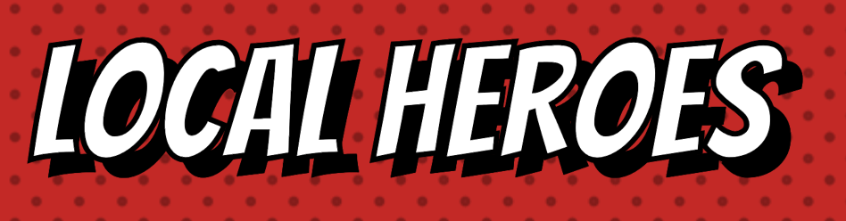
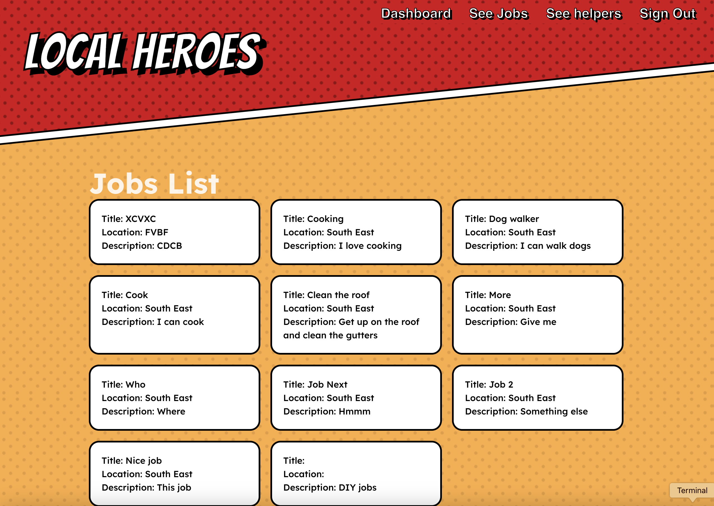

# Local Heroes - Project Overview

<p align="center">
  
  </a>
</p>

## Screenshot of jobs view

<p align="center">
  
  </a>
</p>

## Description

**Local Heroes** is a local community volunteering portal that aims to bring together those who need assistance with day to day or specific tasks and those with the skills and time to help with those tasks. 

Jobs/task could include things such as shopping, cooking, cleaning, DIY or any other task/job a member of the local community would like help with. The focus of the site is on bringing communities together for the benefit of those who need help but also those who provide help. 

* Back-end: [Back-end](https://local-heroes-iris-be.netlify.app)
* Front-end: [Front-end](https://local-heroes-iris.netlify.app/)

## Getting Started

### Back-end

Running locally:

Install dependancies:
```
npm install
```

Start:
```
nodemon server.js
```

### Front-end

Install dependancies:
```
npm install
```

Start:
```
nom run dev
```

Push to GitHub to see latest automatically deployed to Netlify

To view the code for this project, visit the GitHub repository:  
* [**Backend GitHub Repository**](https://github.com/iris-noonan/local-heroes-backend)
* [**Frontend GitHub Repository**](https://github.com/iris-noonan/local-heroes-frontend)

## Timeframe & Working Team (Solo/Pair/Group)

This project was created in one week with an MVP target and several stretch goals. Some stretch goals were met, while others are planned for future development (see below).

**Team:**
* David Millett
* Iris Morais
* Adam G

## Technologies Used

### Planning and Documentation:
* Markdown
* Figma
* Trello
* dbdiagram.io

### Developer Tools:
* VSCode

### Front End:
* React.js
* HTML
* CSS
* JavaScript

### Back End:
* MongoDB
* Express.js
* Node.js
* Mongoose

### Hosting / Cloud Storage:
* Netlify (Deployment)
* Cloudinary (Cloud resource storage)


## Brief

This was a one-week project to create a CRUD application using the MERN stack, applying skills learned in previous weeks of the bootcamp. The deliverables included:
* User stories
* Wireframing
* Planning RESTful routes
* Planning data architecture
* Creating a CRUD site using REACT with an Express backend.

## Planning

* Adam did some initial sketched
* Adam used [Figma](https://www.figma.com/design/Q7AbknqppoxI66zHQFvzTU/Local-Heroes?node-id=3-3&node-type=frame&t=jxTAgcWFLtIHNx8g-0) for page designs
* David and I had input into the designs
* I created an [ERD](https://dbdiagram.io/d/LocalHeroes-671ad53e97a66db9a332f248) for the project
* We used [Trello](https://trello.com/b/LJk3syLl/⭐%EF%B8%8F-local-heroes-⭐%EF%B8%8F) to plan and moved tasks as I completed them
* I didn't use any pseudocode for this project
* We paired during debugging but didn't really pair on any features

---

## Build / Code Process

The biggest challenge I faced on this project was adapting the image upload tutorial that we did in Express to a React + Express setup. The primary difference was the front-end form.

State to contain file:
```js
const [selectedFile, setSelectedFile] = useState(null);
```

Function to handle file selection:
```js
const handleFileSelect = (e) => {
   setSelectedFile(e.target.files[0])
}
```

HTML for file selector:
```html
<input type="file" name="photo" id="photo" accept="image/*" onChange={handleFileSelect} />
```

Added header config to signup call:
```js
const config = {
   headers: {
   'content-type': 'multipart/form-data'
   }
}
const { data } = await axios.post(`${BASE_URL}/signup`, formData, config)
```

Also for this project I implemented an error message box that could be reused on our forms. It isn't very complex but it was good to work on a componenent that could be widely reused through the project.

```js
import styles from './Errors.module.scss'

const Errors = ({ message }) => {
  if (message) {
    return (
      <div className={styles.errors} >
        Error: {message}
      </div>
    )
  }
}

export default Errors
```
Usage:
```html
import Errors from '../../components/Errors/Errors'
```
```html
<Errors message={errors} />
```

## Challenges

* Working so much with others was different.
* Planning went well but it was more challenging with three of us that a solo project.
* We expected to get more done with three of us on the project but we didn't make as much progress on the stretch goals as we thought we would at the start.
* We had a lot of merge confilcts.
* Dealing with the merge conflicts took a lot of time and I'm not sure we always had the correct result.
* Applying things we did in express but to React was more challenging than I was expecting.
* Adding the image upload took some time but in the end I think it went well.
* Conditional rendering of routes wasn't working as expected for a while but that was because I had an error in one of the conditional routes.

## Wins

* First group project going well.
* Image upload modified for React.
* Resolving merge conflicts.
* Using JWT across a project for the first time.
* Using CSS modules.
* Adding 404 page.
* Adding error message component.
* Middleware for both tokens and image upload.

## Key Learnings / Takeaways

* Working as part of a larger group.
* How to split up the work.
* Three times the number of people does not equal three times the amount of work done.
* Merging is difficult.
* It helps to try and avoid scenarios that create conflicts.
* How a project can be split between front-end and back-end (working on the project helped me understand what React is for and what the back-end is for).

## Bugs

Further testing is needed, but for now:
* Header is not filling the page width as we would like.
* Header has some other layout bugs on different screen width.
* The background SVG isn't fully aligned and doesn't repeat correctly.
* Token is not removed and user is not logged out when it is no longer valid.
* Some areas are not as responsive as we would like.

## Future Improvements

1. Add skills table.
2. Connect skills to jobs and helpers.
3. Add a map to show location of jobs on jobs view.
4. Add search to jobs view map.
5. Add filtering to jobs view map.
6. Show nearby jobs on dashboard.
7. Show local helpers on dashboard.
8. Add Badges.
9. Set up functionality to award badges automatically.
10. Show local feed on dashboard.
11. Show completed jobs on dashboard.
12. Add more features around maps and jobs.
